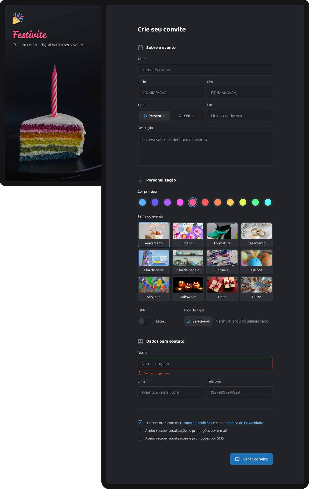

# Boas-vindas ao projeto formulário de convite
Olá, nesse projeto demonstro um pouco das habilidades adquiridas com HTML e CSS, estruturando um formulário de convite com algumas validações nos campos.

Nesse projeto é utilizando CSS avançado para as validações e estilizações nos campos inputs. Também é utilizado um pouco de javascript para fazer a troca do label ao selecionar o tipo de tema escuro ou claro.

## Formulário de convite

